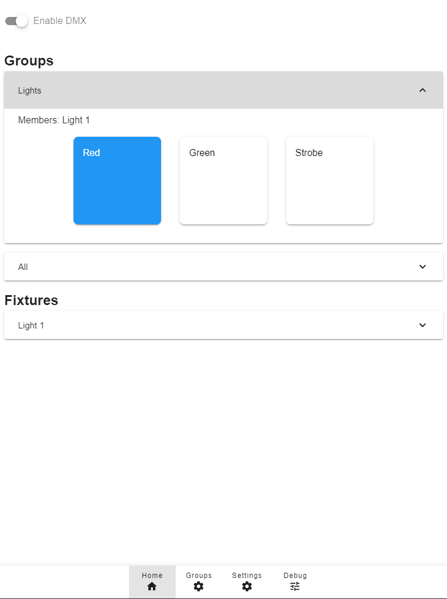

# ESP32-DMXController
**Webinterface for controlling DMX Fixtures. Runs on ESP32**

## Software
### Features
- Supports multiple Fixtures
- Create Scenes

### Screenshots

Change multiple Fixtures at once using Scenes

Or control individual Fixtures

Scene Setup

Fixture Setup

### Installation
[Web based flasher](https://burgha.github.io/esp32-dmxcontroller/)

## Hardware
### Components
- ESP32
- TTL to RS485 Adapter (such as the MAX485) 

### Wiring
